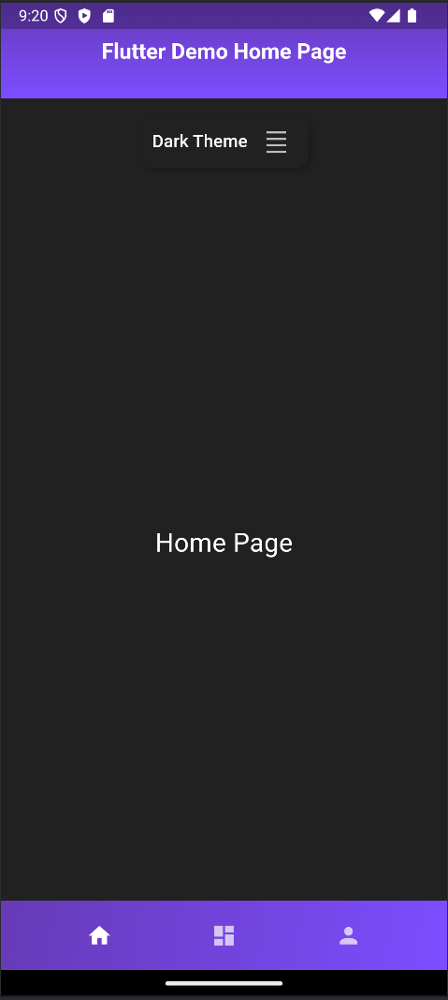
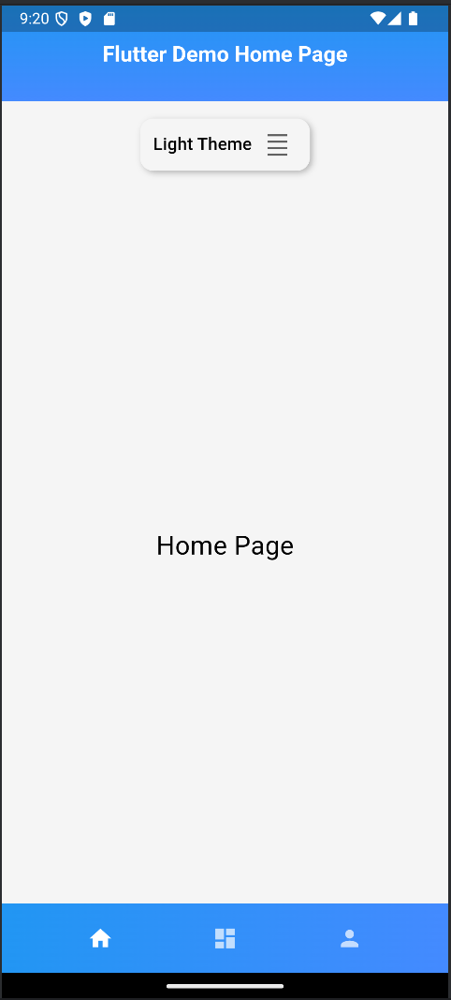
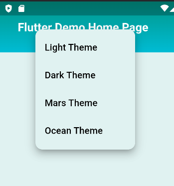

# my_flutter_proj1

This is a backend manager project for my personal app.

## Getting Started

This project is a starting point for a Flutter application.

## Now, there are some basic features:

